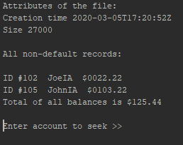

<h2>Chapter 13 Java</h2>

<li>PURPOSE OF PROJECT: Reading and writing .txt files</li>
<li>DATE: March 5, 2020</li>
<li>AUTHOR: Joseph Chalupa</li>

<h3>How the code is writing the .txt file:</h3>

The code is using a .write statement to edit the statement. You also have to use a try statement to see if you can even open file in the first place. When the file opens either the user will input something to change a line in the text, or something will be coded to automatically write on the text file. Finally, the statement .save() and .close() will be used to close and save the file.

<h3>How the code is reading the .txt file:</h3>

<h3>What is a try-catch statement and why you need the catch:</h3>

<h2>Lesson 1.2.1</h2>

#3. public static String readString() - gets file number input

public static void writeString(String s) - edits the file

public static void saveAndClose() - saves the changes

#21. When there is no more text to read the while loop ends because it equals null.

#29. I feel a while loop would be better because it will constantly check if it has another song to display.

<h3>Conclusion Q's</h3>

#1. A for loop uses the exact amount and will repeat the exact amount of times which will need it to. While a while loop will repeat until the boolean statement comes back false which is good for reading text documents.

#2. When smartphones became more popular and more used.

